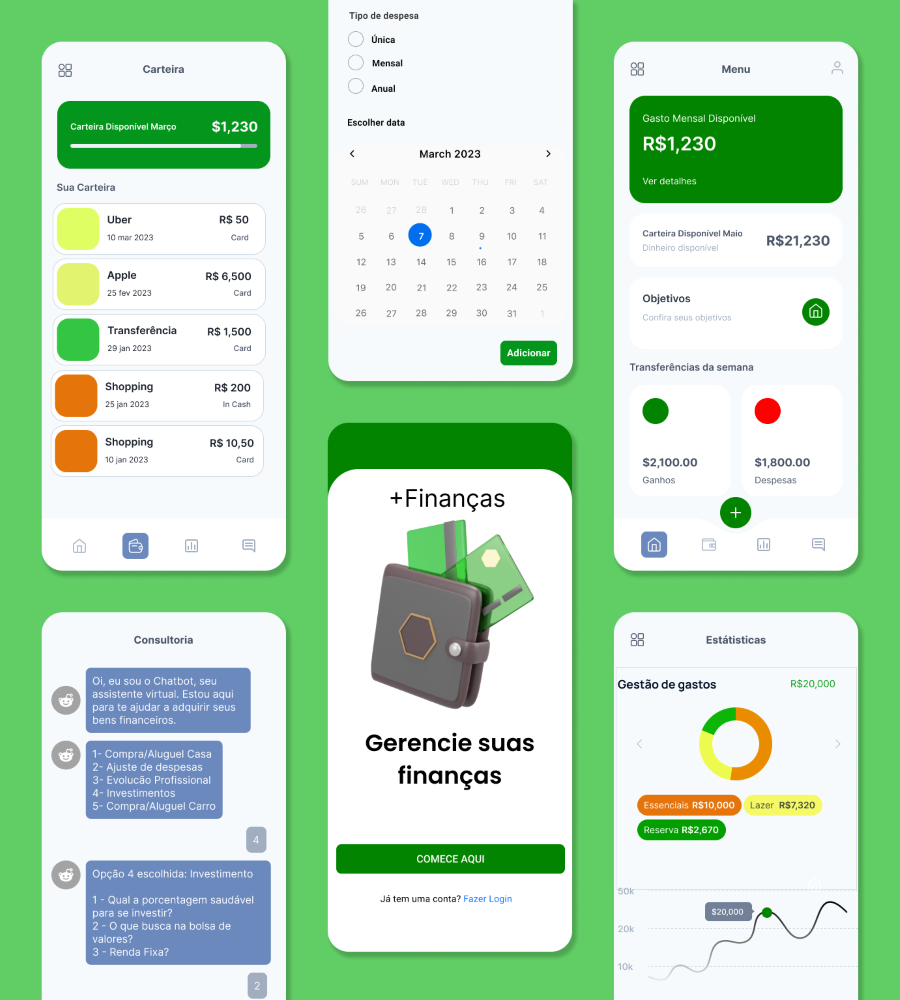

<!-- TODO: Banner deve vir aqui -->

<!-- TODO: Badges devem vir aqui -->

# 💲Mais Finanças App💲

O Mais Finanças App é um aplicativo de gerenciamento de despesas e auxílio para aquisição de objetivos financeiros desenvolvido para a plataforma Android.

## 📋 Funcionalidades

- [X] Registro de Despesas
- [ ] Acompanhamento de Gastos
- [ ] Lembretes e Notificações
- [ ] Objetivos Financeiros
- [ ] Sugestões para balanceamento de gastos
- [ ] Autenticação e autorização
- [ ] Caching dos dados
- [ ] Criptografia dos dados sensíveis

## 📱Screenshots

## ⇩ Instalação

O download do arquivo APK mais recente do aplicativo está disponível através deste [link](https://github.com/mais-financas/mais-financas-app/tree/main/app/release/app-release.apk?raw=true).

## 🫴Autores

- [Gustavo Almeida Carvalho](https://www.github.com/gustxvo)
